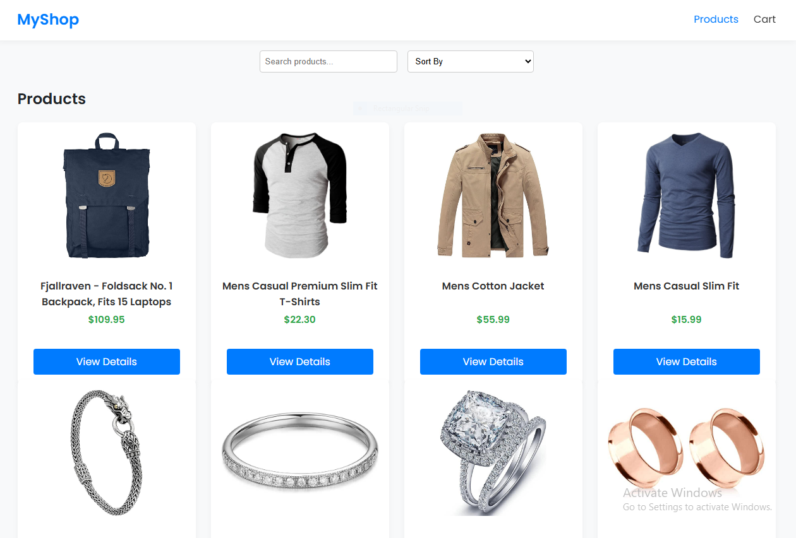
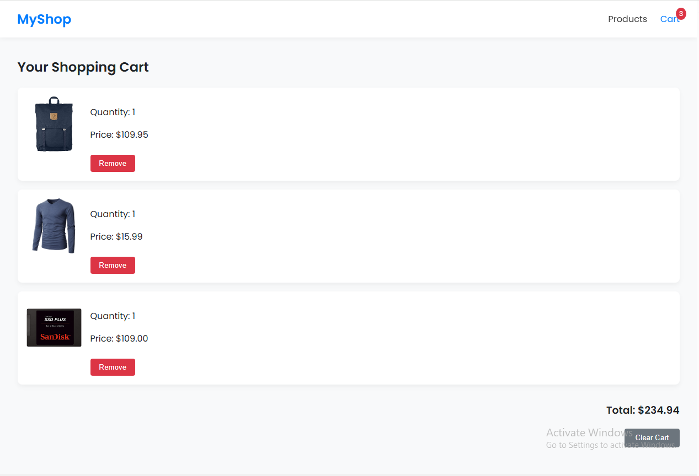
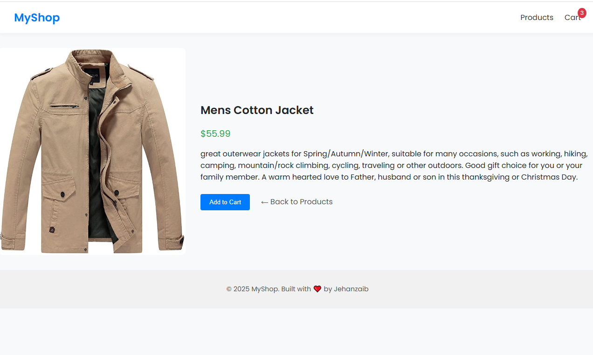
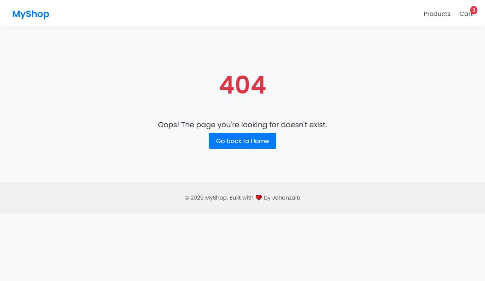

# 🛒 NovaCart

NovaCart is a modern, responsive eCommerce shopping cart built using React.  
It features dynamic product loading, interactive cart management, theme toggling, and a polished UI — all designed for portfolio-level presentation.

---

## 🚀 Live Demo
👉 [View Live](https://mynovacart.netlify.app/)

---

## 📦 Features

- ✅ Product listing from [Fake Store API](https://fakestoreapi.com/)
- ✅ Product details page with "Add to Cart"
- ✅ Cart page with quantity control, remove, and clear functions
- ✅ Persistent cart saved in `localStorage`
- ✅ Search and sorting (by price and name)
- ✅ Toast notifications for user feedback
- ✅ 404 Not Found route with animation
- ✅ Route guarding (protect empty cart access)
- ✅ Light/Dark mode toggle with saved preference
- ✅ Fully responsive design
- ✅ Animated UI elements for better UX

---

## 🧰 Tech Stack

- **React** (Hooks, Context API)
- **React Router DOM**
- **React Toastify**
- **CSS Modules + Variables**
- **Fake Store API**
- **localStorage API**
- **Custom dark/light theming**

---

## 📸 Screenshots

### 🏠 Home Page

### 🛒 Cart Page

### Product Details

### 404 not found

---

## 🛠️ Installation

git clone https://github.com/your-username/shopping-cart
cd shopping-cart
npm install
npm start

🧪 Deployment
Deployed using Netlify (or Vercel):

Just connect your GitHub repo

Set the build command: npm run build

Output directory: dist (if using Vite) or build (if using CRA)
---

## 👨‍💻 Author

Made with ❤️ by **Jehanzaib**

📫 **Email**: [jehanzaib-dev@gmail.com](mailto:jehanzaib.dev@gmail.com)  
🔗 **LinkedIn**: [linkedin.com/in/jehanzaib-arshad-a722b6369](https://www.linkedin.com/in/jehanzaib-arshad-a722b6369/)

